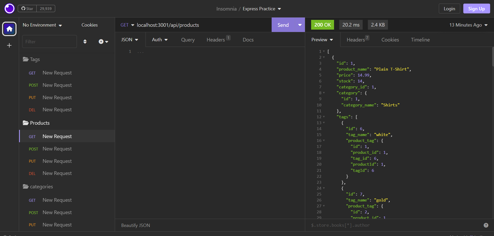

# ecommerce-backend

## Description

This node server-ran application will allow the user to go through the steps of CRUD(create, read, update and delete) on a back-end ecommerce database. The user, through the insomnia application, will be able to generate the entirety of a categories, products, and tags database as well as have the ability to get, post, put and even delete various entries all according to the user's preferences. 

## Usage
ecommerce backend walkthrough:https://drive.google.com/file/d/1Gq-ICnGNONaBHBph3gjTllbWoX8IPwvL/view?usp=sharing 
ecommerce backend screenshot: 

## Credits
The following site assisted in basic and general JS concepts as well as how to operate JS itself using various methods and syntax: https://www.w3schools.com/js/js_syntax.asp
The following site helped with learning how to set up various JS algorithms as well as how they affected your code as a whole: https://www.freecodecamp.org/learn/javascript-algorithms-and-data-structures/#basic-javascript
The following individual's github profile indicates partnership in regards to working together and collaborating/sharing constructive ideas with the ecommerce background challenge: https://github.com/LucasWyski001
The following individual's github profile indicates partnership in regards to working together and collaborating/sharing constructive ideas with the ecommerce background challenge: https://github.com/micavilla
The following individual's github profile indicates partnership in regards to working together and collaborating/sharing constructive ideas with the ecommerce background challenge: https://github.com/Rockojoe2 The following individual's github profile indicates partnership in regards to working together and collaborating/sharing constructive ideas with the ecommerce background challenge: https://github.com/mayphamx

## License
MIT License

Copyright (c) 2023 drog41813

Permission is hereby granted, free of charge, to any person obtaining a copy
of this software and associated documentation files (the "Software"), to deal
in the Software without restriction, including without limitation the rights
to use, copy, modify, merge, publish, distribute, sublicense, and/or sell
copies of the Software, and to permit persons to whom the Software is
furnished to do so, subject to the following conditions:

The above copyright notice and this permission notice shall be included in all
copies or substantial portions of the Software.

THE SOFTWARE IS PROVIDED "AS IS", WITHOUT WARRANTY OF ANY KIND, EXPRESS OR
IMPLIED, INCLUDING BUT NOT LIMITED TO THE WARRANTIES OF MERCHANTABILITY,
FITNESS FOR A PARTICULAR PURPOSE AND NONINFRINGEMENT. IN NO EVENT SHALL THE
AUTHORS OR COPYRIGHT HOLDERS BE LIABLE FOR ANY CLAIM, DAMAGES OR OTHER
LIABILITY, WHETHER IN AN ACTION OF CONTRACT, TORT OR OTHERWISE, ARISING FROM,
OUT OF OR IN CONNECTION WITH THE SOFTWARE OR THE USE OR OTHER DEALINGS IN THE
SOFTWARE.